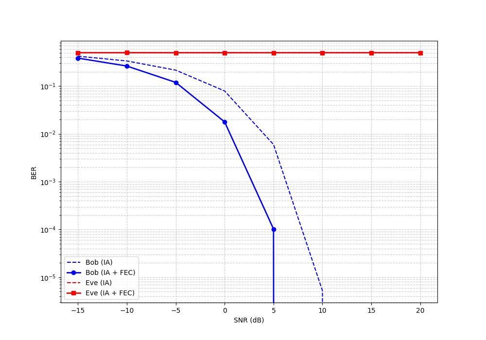
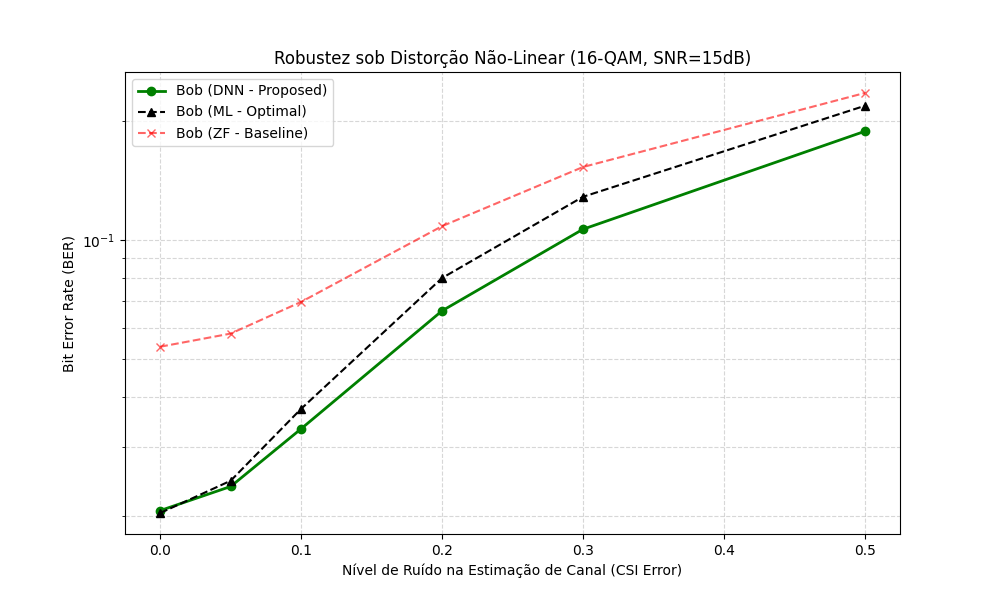

# PLS-DNN: Segurança de Camada Física em Redes 6G com Deep Learning


Repositório oficial do projeto da disciplina de **Segurança da Informação** (2025.2) da **Universidade Federal do Agreste de Pernambuco (UFAPE)**.

## Sobre o Projeto

Este projeto consiste em uma investigação sobre a aplicação de Deep Learning para garantir a segurança na camada física (Physical Layer Security - PLS) em redes móveis de sexta geração (6G). Diferente da criptografia convencional, o sistema utiliza as características estocásticas do canal de comunicação para proteger os dados.

A simulação foca em canais com desvanecimento Rayleigh, modelando cenários de alta mobilidade onde o receptor legítimo utiliza a informação de estado do canal ($CSI$) para decodificar a mensagem. O objetivo central é demonstrar como uma Rede Neural Profunda ($DNN$), aliada a técnicas de correção de erro ($FEC$), pode criar um canal de comunicação confiável e seguro contra interceptadores passivos, superando métodos lineares tradicionais em cenários de distorção de hardware.

A implementação atual compara três abordagens:

Zero-Forcing (ZF): Baseline linear tradicional (falha sob distorção não-linear).

Maximum Likelihood (ML): Limite teórico ótimo (alta complexidade computacional).

Deep Neural Network (DNN): Proposta baseada em dados (alta robustez e baixa complexidade).

## 📂 Estrutura do Repositório

O projeto foi reestruturado para suportar múltiplos cenários de forma modular, separando experimentos lineares (BPSK) de não-lineares (16-QAM com HPA).

```bash
.
├── docs/                       # Documentação acadêmica e artefatos
├── files/                      # Arquivos auxiliares (LaTeX, Referências)
├── results/                    # Gráficos gerados automaticamente
├── src/                        # Código-fonte modular
│   ├── main.py                 # Orquestrador (Executa toda a pipeline)
│   ├── linear/                 # Cenário 1: BPSK (Validação de Baseline)
│   │   ├── linear_main.py
│   │   ├── stress_test.py
│   │   ├── communication.py
│   │   ├── models.py
│   │   └── fec_utils.py
│   └── non_linear/             # Cenário 2: 16-QAM + HPA (Desafio 6G)
│       ├── nl_main.py
│       ├── stress_test.py
│       ├── communication.py
│       ├── models.py
│       └── fec_utils.py
├── LICENSE
├── README.md
└── requirements.txt# Pasta central de saída
```

## 🚀 Como Rodar Localmente

Siga os passos abaixo para clonar e executar a simulação no seu ambiente Linux.

### 1. Pré-requisitos
Certifique-se de ter o **Python 3** e o **Git** instalados.

### 2. Clonar o Repositório
```bash
git clone [https://github.com/fernando7492/projeto-devops-time-SI.git](https://github.com/fernando7492/projeto-devops-time-SI.git)
cd projeto-devops-time-SI/codes
```

### 3. Configurar o Ambiente Virtual
Recomendamos usar um ambiente virtual (`venv`) para isolar as dependências.

```bash
# Criar o ambiente virtual (na pasta oculta .venv)
python3 -m venv .venv

# Ativar o ambiente
source .venv/bin/activate
```

### 4. Instalar Dependências
Instale as bibliotecas necessárias (`torch`, `numpy`, `scipy`, `matplotlib`).

```bash
pip install -r requirements.txt
```

> **Nota:** Se você não possui uma GPU dedicada ou tem pouco espaço em disco, use o comando abaixo para instalar a versão leve (CPU-only) do PyTorch:

```bash
pip install torch --index-url [https://download.pytorch.org/whl/cpu](https://download.pytorch.org/whl/cpu)
pip install numpy scipy matplotlib
```

### 5. Executar a simulação completa
Execute o script:

```bash
python main.py
```

### 🔍 O que esperar da execução?
1.  O script detectará automaticamente seu hardware (CPU ou GPU).
2.  Executará os treinamentos para BPSK e 16-QAM.
3.  Realizará os testes de estresse comparando a IA com algoritmos clássicos (ZF e ML).
4.  Os resultados gráficos serão salvos automaticamente na pasta results/.

---

## Resultados

A simulação gera gráficos comparativos de Taxa de Erro de Bit (BER) versus Relação Sinal-Ruído (SNR).

1. Cenário Linear (Baseline BPSK)

Neste cenário, a DNN atinge a otimalidade matemática, empatando tecnicamente com o equalizador Zero-Forcing em condições ideais, mas mantendo o sigilo contra a interceptadora (Eve).

2. Cenário Não-Linear (Desafio 16-QAM + HPA)

Aqui, a superioridade da IA se torna evidente. Devido à distorção do amplificador de potência, o método linear clássico (ZF) colapsa, apresentando um alto piso de erro. A DNN, por sua vez, aprende a curva de distorção e recupera o sinal com precisão.





## Teste de estresse
Em cenários reais de redes 6G (V2X), a estimativa do estado do canal ($CSI$) raramente é perfeita. Para validar a robustez, submetemos os receptores a um teste de estresse variando o erro de estimação de 0% a 50%.

Conclusão Principal: A DNN demonstrou ser mais robusta que o Maximum Likelihood (ML) em cenários de alta incerteza (erro de CSI > 10%), provando ser a solução ideal para ambientes dinâmicos onde a matemática rígida falha.



---

## 👥 Equipe
* [**Emanuel Reino**](https://github.com/Emanuel-Al)
* [**Fernando Emidio**](https://github.com/Fernando7492)
* [**Gustavo Wanderley**](https://github.com/MESTREGUGABr)
* [**Pedro William**](https://github.com/pedrowillliam)
* [**Pedro José**](https://github.com/PJota021)
## Professor coordenador

* [**Professor Sergio Mendonça**](https://github.com/sftom)

---
Desenvolvido no contexto acadêmico da UFAPE.
